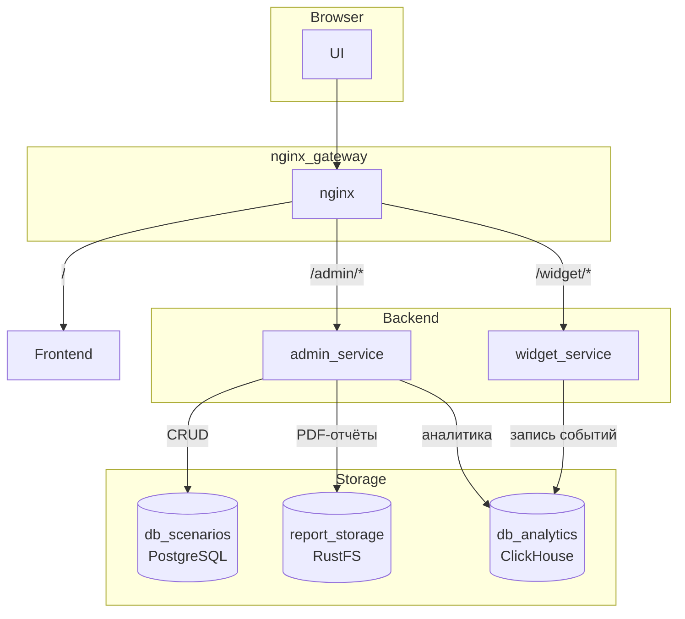
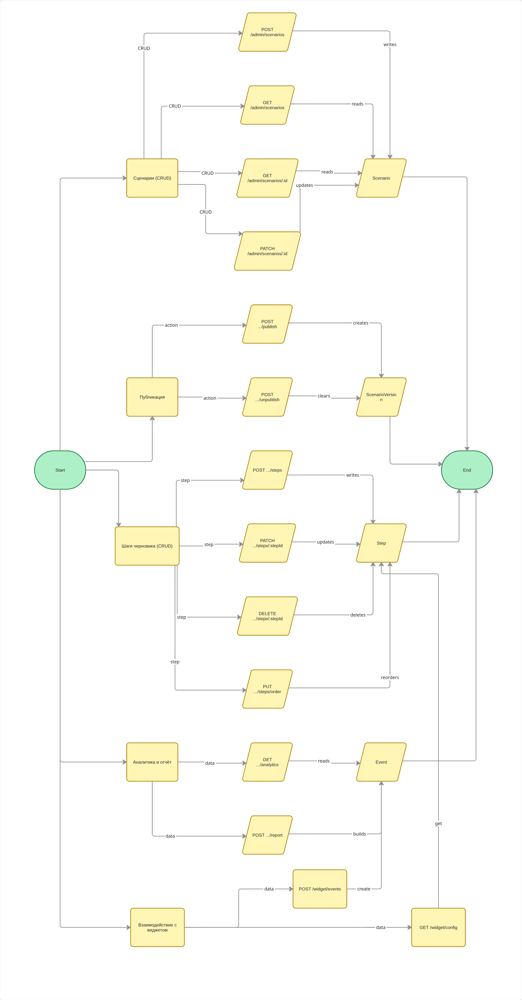

# Interactive Onboarding

Платформа для создания, публикации и аналитики интерактивных онбординг-сценариев с встраиваемым виджетом.

<details>
<summary>Содержание</summary>

- [Запуск](#запуск)
- [Стек](#стек)
- [Архитектура](#архитектура)
- [API](#api)
- [Разработка](#разработка)
  - [Структура проекта](#структура-проекта)
  - [Сборка и тесты](#сборка-и-тесты)
  - [Интеграционные тесты](#интеграционные-тесты)
  - [Кодогенерация](#кодогенерация)
  - [Линтеры](#инструменты-статического-анализа-и-обоснование-правил)
- [Ключевые технические решения](#ключевые-технические-решения)
- [Пуш SDK в npm regestry](#пуш-sdk-в-npm-regestry)
- [Ограничения MVP](#ограничения-mvp)

</details>

### Запуск

> [!NOTE]
> Для большинства задач управления проектом мы используем `make`. Вызовите `make help`
> для вывода доступных команд.

#### Быстрый старт

- Скопируйте конфигурацию окружения по умолчанию

```bash
cp .env.example .env
```

> [!NOTE]
> Если порты `80` и `9001` на хосте уже заняты, измените их в `.env` на свободные и не забудьте применить, например:
> ```ini
> GATEWAY_PORT=1050
> RUSTFS_CONSOLE_PORT=9009
> ```

- Запуск контейнеров, миграций, seed'ов

```bash
make start
```

#### Запуск руками

- Скопируйте конфигурацию окружения по умолчанию

```bash
cp .env.example .env
```

- Запустите проект через docker compose

```bash
docker compose up -d
```

- Примените миграции базы данных

```bash
docker compose --profile migrate up migrate
```

- Заполните базу демо-данными (проект, сценарии, шаги, события аналитики)

```bash
docker compose --profile seed up seed --build
```

- Откройте http://localhost
 
| URL | Назначение |
|-----|------------|
| `http://localhost` | Frontend SPA + API Gateway |
| `http://localhost/admin` | Админ-панель |
| `http://localhost/admin/analytics` | Дашборд аналитики |
| `http://localhost:9001` | Консоль RustFS S3 |

## Стек

| Категория | Технологии |
|-----------|------------|
| Языки | Go 1.26, TypeScript, SQL |
| Бэкенд-фреймворки | chi (роутер), sqlc (типизированный SQL), golang-migrate (миграции) |
| Базы данных | PostgreSQL 18, ClickHouse 26.3 |
| Фронтенд | React 19, Vite, Redux Toolkit |
| UI-библиотеки | Radix UI, Lucide |
| SDK виджета | Собственный `onboarding-sdk` (React) |
| API | REST (OpenAPI 3.0) |
| Кодогенерация | oapi-codegen (Go), openapi-typescript (TypeScript) |
| PDF Engine| gpdf |
| Хранилище | RustFS (S3 совместимое) |
| Тестирование | Go test, Testcontainers (PostgreSQL), Jest, React Testing Library |
| CI/CD | GitHub Actions (сборка, тесты, линтинг, интеграционные тесты) |
| Tools | Docker, Docker Compose, nginx |


## Архитектура



| Сервис | Назначение |
|--------|------------|
| Frontend + API Gateway | Маршрутизация и раздача статики |
| admin_service | Управление сценариями, шагами, аналитика, PDF |
| widget_service | Выдача сценариев виджету, приём событий |
| db_scenarios (PostgreSQL) | Хранение сценариев и шагов |
| db_analytics (ClickHouse) | Аналитические запросы |
| report_storage (RustFS/S3) |  Хранение PDF-отчётов |


## API

### Admin API (`/api/v1/admin/`)

| Метод | Путь | Описание |
|--------|------|----------|
| `GET` | `/admin/projects/{projectKey}` | Получить проект по ключу |
| `GET` | `/admin/scenarios` | Список сценариев |
| `POST` | `/admin/scenarios` | Создать сценарий |
| `GET` | `/admin/scenarios/{id}` | Получить сценарий + шаги |
| `PATCH` | `/admin/scenarios/{id}` | Обновить сценарий |
| `POST` | `/admin/scenarios/{id}/publish` | Опубликовать сценарий |
| `POST` | `/admin/scenarios/{id}/unpublish` | Снять с публикации |
| `POST` | `/admin/scenarios/{id}/steps` | Создать шаг |
| `PATCH` | `/admin/scenarios/{id}/steps/{stepId}` | Обновить шаг |
| `DELETE` | `/admin/scenarios/{id}/steps/{stepId}` | Удалить шаг |
| `PUT` | `/admin/scenarios/{id}/steps/order` | Изменить порядок шагов |
| `GET` | `/admin/analytics/{scenarioId}` | Получить аналитику сценария |
| `GET` | `/admin/analytics/{scenarioId}/report` | Скачать PDF-отчёт |
| `POST` | `/admin/analytics/{scenarioId}/report` | Сгенерировать PDF-отчёт |

### Widget API (`/api/v1/widget/`)

| Метод | Путь | Описание |
|--------|------|----------|
| `GET` | `/widget/scenario?projectKey=...&pageUrl=...` | Получить опубликованный сценарий + шаги для страницы |
| `POST` | `/widget/event` | Отправить событие онбординга |




## Разработка

### Структура проекта

```
deploy/                           # yaml файлы и конфиги для подключения в docker compose
  database
  gateway
  migrations
  report_storage/rustfs
  seed

pkg/
  configs                         # общие конфиг структуры
  database                        # Фабрика для работы с БД
  pdfengine                       # Фабрика для работы с pdf генераторами 
  s3                              # Фабрика для работы с s3 совместимыми хранилищами

services/admin/                   # Admin Service
  internal/
    config/                       # Конфигурация приложения
    delivery/http/                # HTTP-обработчики (chi)
    domain/                       # Доменные типы (Analytics, Scenario, Step, Event)
    infrastructure/               # Адаптеры БД (publishes, scenarios, steps, analytics, projects)
    service/                      # Бизнес-логика
  queries/sqlc/                   # SQL + сгенерированный код (sqlc)

services/widget/                  # Widget Service
  internal/
    delivery/http/                # HTTP-обработчики (chi)
    domain/                       # Доменные типы (Scenario, Step, Event, Project)
    infrastructure/repository/    # Адаптеры БД
    service/                      # Бизнес-логика
  queries/sqlc/                   # SQL + сгенерированный код (sqlc)

frontend/                         # npm workspaces (React 19 + Vite)
  apps/web/                       # Основное SPA (Feature-Sliced Design)
  packages/onboarding-sdk/        # Встраиваемый SDK виджета
  packages/shared/                # Общие типы и DTO
  packages/ui/                    # UI-примитивы (обёртки Radix UI)

tests/                            # Ощие хелперы для тестов
  dbScenario/                     # StartPostgres + реальные миграции (для интеграционных тестов)

migrations/postgres/              # Миграции БД
api/openapi/v1/                   # Спецификации OpenAPI 3.0
gen/rest/v1/go/                   # Сгенерированный код Go
```

### Сборка и тесты

```bash
# Admin-сервис
cd services/admin
go build ./...
go vet ./...
go test -race -count=1 ./...
golangci-lint run --config=../../.golangci.yaml

# Widget-сервис
cd services/widget
go build ./...
go vet ./...
go test -race -count=1 ./...
golangci-lint run --config=../../.golangci.yaml

# Фронтенд
cd frontend
npm ci
npm run typecheck
npm run lint
npm test
npm run build
```

### Интеграционные тесты

Интеграционные тесты поднимают реальный PostgreSQL через Testcontainers, применяют миграции через образ `migrate/migrate:v4.19.1` (тот же, что и в production) и тестируют инфраструктурный слой на живой БД.

```bash
# Интеграционные тесты admin-service
cd services/admin
go test -tags=integration -count=1 -timeout 10m ./internal/infrastructure/...

# Интеграционные тесты widget-service
cd services/widget
go test -tags=integration -count=1 -timeout 10m ./internal/infrastructure/...
```

### Кодогенерация

```bash
make rest-gen-admin     # Admin: Go server + DTO + типы TypeScript
make rest-gen-widget    # Widget: Go server + DTO + типы TypeScript
make api-gen            # Всё сразу
```

### Инструменты статического анализа и обоснование правил

#### Go: golangci-lint

```yaml
# .golangci.yaml
linters:
  enable:
    - errcheck
    - govet
    - ineffassign
    - staticcheck
    - unused
```

| Линтер | Что проверяет | Почему включили |
|--------|--------------|-----------------|
| **errcheck** | Все возвращаемые ошибки обработаны | Необработанная ошибка - одна из главных причин багов в Go. Закрытие `io.ReadCloser`, `rows.Close()`, `tx.Rollback()` без проверки ошибки может скрыть потерю данных. |
| **govet** | Подозрительные конструкции: unreachable code, неверные fmt-спецификаторы, копирование sync.Mutex | Стандартный инструмент из поставки Go. Ловит ошибки компиляции, которые `go build` пропускает (например, `fmt.Printf("%s", intVal)`). |
| **ineffassign** | Присваивания, которые нигде не читаются | `val := getX()` и затем сразу `val = getY()` - первое присваивание бесполезно. Указывает либо на мёртвый код, либо на логическую ошибку. |
| **staticcheck** | Сотни проверок: устаревшие API, упрощения кода, неправильное использование стандартной библиотеки | Мощный анализатор. Например, ловит `time.Time` сравнение через `==`, закрытие `http.Response.Body` без чтения, `defer` внутри циклов без замыкания. |
| **unused** | Неиспользуемые переменные, функции, типы, импорты | В Go неиспользуемая функция не ловится во время компиляции. Линтер же находит такой мёртвый код. |

> [!NOTE]
> `golangci-lint` использует кеширование и работает в разы быстрее, чем запуск отдельных линтеров. Сами правила - минимальный необходимый набор, чтобы предовтратить самые частые баги и мёртвый код.

#### Frontend: ESLint + TypeScript strict

```ts
// tsconfig.base.json - ключевые флаги
"strict": true,
"noUnusedLocals": true,
"noUnusedParameters": true,
"noFallthroughCasesInSwitch": true,
"verbatimModuleSyntax": true
```

```js
// eslint.config.js - подключены правила
extends: [
  js.configs.recommended,         // базовые правила JavaScript
  tseslint.configs.recommended,   // правила TypeScript
  reactHooks.configs.flat.recommended, // правила хуков React
  reactRefresh.configs.vite,      // предупреждения о HMR-несовместимом коде
]
```

| Правило | Что проверяет | Почему включили |
|---------|--------------|-----------------|
| **strict: true** | Все strict-флаги TypeScript разом: `strictNullChecks`, `noImplicitAny`, `strictFunctionTypes` и др. | Не даёт пропустить `undefined`/`null` в местах, где их быть не должно. В комбинации с discriminated unions исключает целый класс багов без единого runtime-check. |
| **noUnusedLocals / noUnusedParameters** | Неиспользуемые переменные и параметры | Исключение мёртвого кода |
| **noFallthroughCasesInSwitch** | Запрет «проваливания» в switch-case | Классический источник багов: забытый `break` в JavaScript. TypeScript делает это ошибкой компиляции. |
| **verbatimModuleSyntax** | Импорты/экспорты должны быть написаны явно (`import type` для типов, `export type` для ре-экспорта) | После сборки Vite выбрасывает type-only импорты. Если тип импортирован без `type` - может сломаться tree-shaking или возникнуть циклическая зависимость. |
| **eslint:recommended** | Базовые правила: `no-undef`, `no-unused-vars`, `no-debugger` | Минимальная защита от опечаток и отладочного кода в production. |
| **tseslint:recommended** | Правила поверх TypeScript: запрет `any` в strict-контексте, корректность generics | Дополняет `strict: true` - то, что компилятор TypeScript не всегда может проверить (например, `@ts-ignore` без комментария). |
| **react-hooks** | Правила хуков: зависимости useEffect, порядок вызова | Нарушение правил хуков приводит к трудноуловимым багам: устаревшие замыкания, бесконечные ререндеры, пропущенные обновления. |
| **react-refresh** | Код, несовместимый с Vite HMR | Vite не может применить Hot Module Replacement к компонентам, экспортируемым не как функции. Линтер предупреждает заранее - иначе после изменения страницу придётся перезагружать вручную. |


## Ключевые технические решения

### UUIDv7 (хронологически упорядоченные первичные ключи)

Все таблицы используют UUIDv7 в качестве первичных ключей через встроенную функцию PostgreSQL 18 `uuidv7()` - глобально уникальные, упорядоченные по времени, удобные для B-tree индексов.

### PDF-отчёты по аналитике

Admin-сервис генерирует PDF-отчёты с помощью gpdf. Отчёт содержит таблицу-воронку (просмотры шагов → завершения шагов → завершения сценария → скрытия). Загружается в S3-совместимое хранилище.

### Частичные уникальные индексы

URL сценариев должны быть уникальны **в пределах статуса**: черновик и опубликованный сценарий могут иметь один и тот же URL (что позволяет редактировать черновик, пока опубликованная версия работает). Обеспечивается через:

```sql
CREATE UNIQUE INDEX ON scenario (project_id, url) WHERE status = 'draft';
CREATE UNIQUE INDEX ON scenario (project_id, url) WHERE status = 'published';
```

### Разработка на основе OpenAPI

Контракты API находятся в `api/openapi/v1/{service}/specs.yaml`. Интерфейсы сервера и запросы клиента генерируются из этих спецификаций, что упрощает разработку в случае изменения API спецификации.

### Использование колоночной БД (ClickHouse) под аналитику

Для хранения и агрегации событий онбординга используется **ClickHouse** - колоночная аналитическая база данных. Почему он, а не только PostgreSQL:

- **Колоночное хранение** - данные лежат по столбцам, а не по строкам. Когда нужно посчитать просмотры или построить воронку, запрос читает только нужные столбцы, а не всю строку целиком. Это в разы быстрее.
- **Сильное сжатие** - за счёт сортировки и колоночного формата ClickHouse сжимает данные в 5–20 раз. Сотни миллионов событий занимают минимум места.
- **Быстрые агрегации** - `COUNT`, `SUM`, `GROUP BY` выполняются на уровне процессора с векторными инструкциями, а не обходом каждой строки по очереди.
- **Не мешают друг другу** - события пишутся в PostgreSQL синхронно (быстро, с гарантией), а ClickHouse подтягивает их в фоне. Запись событий и аналитические запросы не пересекаются.

PostgreSQL занят оперативной работой (сценарии, шаги, проекты), а ClickHouse - аналитикой (воронки, отчёты, дашборды). Каждый делает своё дело.

## Пуш SDK в npm regestry

SDK виджета (`@interactive-onboarding/onboarding-sdk`) и его зависимости (`@interactive-onboarding/api-client`, `@interactive-onboarding/shared`) публикуются в npm regestry для использования внешними проектами.

### Подготовка к публикации

Перед первым пушем необходимо снять флаг `private` в `package.json` пакетов, которые будут публиковаться:

```json
// frontend/packages/onboarding-sdk/package.json
"private": false

// frontend/packages/api-client/package.json
"private": false

// frontend/packages/shared/package.json
"private": false
```

> [!WARNING]
> Делайте это осознанно - после снятия `private` пакет станет доступен для публикации. Убедитесь, что версия в `package.json` актуальна.

### Публикация

```bash
cd frontend

# Собрать все workspace-пакеты
npm run build

# Опубликовать зависимости SDK
cd packages/shared     && npm publish --access public
cd ../api-client       && npm publish --access public

# Опубликовать сам SDK
cd ../onboarding-sdk   && npm publish --access public
```

### Использование SDK внешним проектом

После публикации SDK подключается в проект через npm:

```bash
npm install @interactive-onboarding/onboarding-sdk
```

Инициализация виджета:

```ts
import { initOnboarding } from '@interactive-onboarding/onboarding-sdk'

initOnboarding({
  projectKey: 'your-project-key',
  apiBaseUrl: 'https://your-api.example.com',
})
```

Либо через React-провайдер:

```tsx
import { OnboardingProvider } from '@interactive-onboarding/onboarding-sdk/react'

<OnboardingProvider
  apiClient={apiClient}
  navigate={routerNavigate}
  pageUrl={location.pathname}
  projectKey="your-project-key"
/>
```

## Ограничения MVP

- **Один проект** - платформа поддерживает один проект на развёртывание. Поддержка нескольких проектов не реализована.
- **Нет аутентификации** - admin API и widget API не защищены.
- **SQL-запросы не оптимизированы** под read-реплики или кеширование.
- **PDF-отчёты** генерируются синхронно - большая аналитика может заблокировать запрос.
- **Неинтуитивное создание шага** - человек без базового понимания, что такое "Селектор элемента", будет испытывать трудности при создании нового компонента
